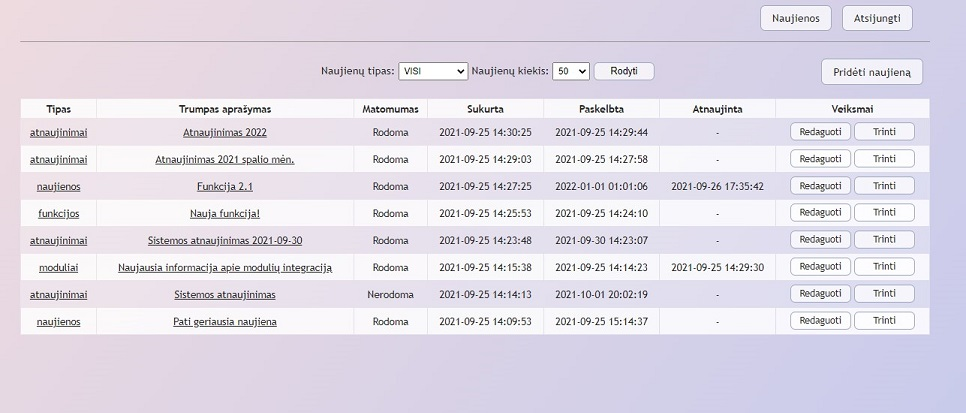
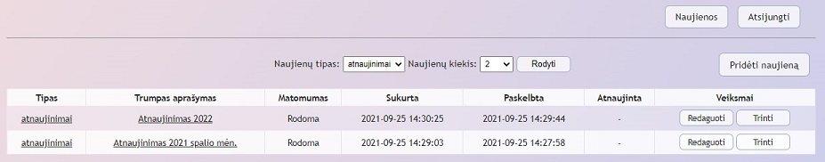
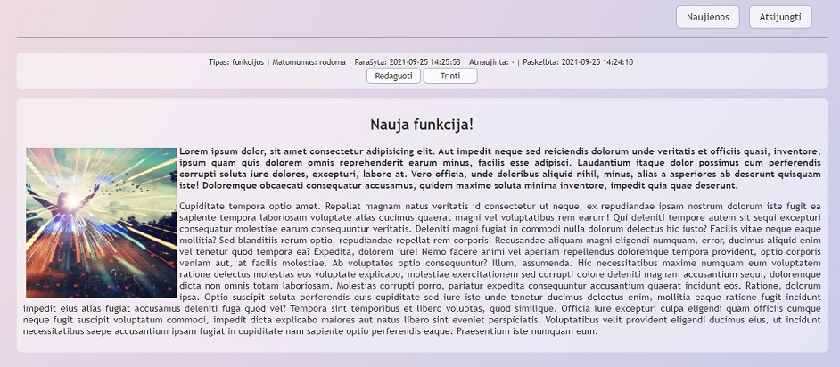
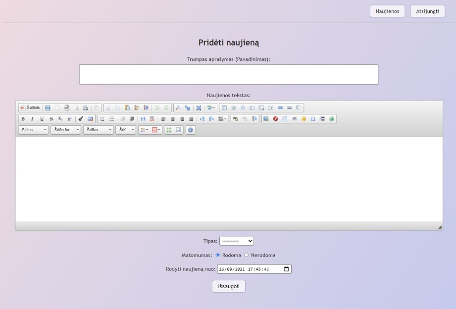
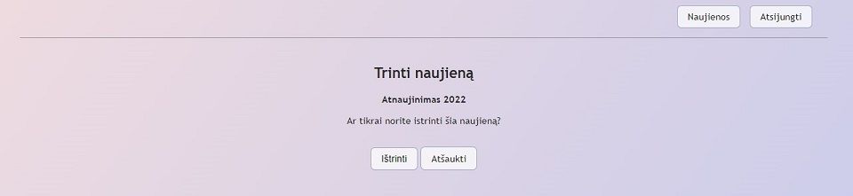
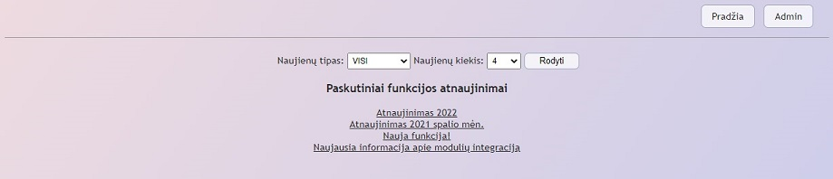
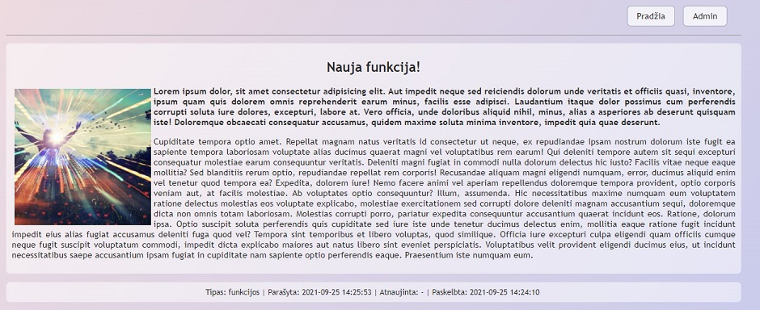

## Naujienų sistema

Administravimas, pagrindinis vaizdas:

Administravimas, naujienų filtravimas:

Administravimas, naujienos rodymas:

Administravimas, naujienos įvedimas:

Administravimas, naujienos trynimas:

Neprisijungus, naujienų sąrašas:

Neprisijungus, naujienos rodymas:

